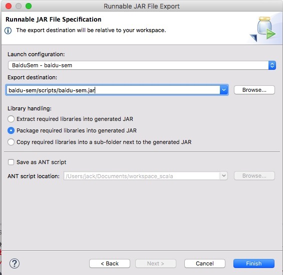

# 百度 SEM

## 快速连接

- [设计文档](design/design.md)
- [api-docs](api-docs)


## 基础设施，部署环境

### Java ETL

- [Java ETL src](http://git.corp.angejia.com/dw/uba/tree/master/scripts/baidu-sem) 负责从百度拉取结构数据到本地文件后，然后写入到 hadoop 的 table 对应分区中
- [Java ETL 调度地址](http://dw.corp.angejia.com/monitor/getSchedulerJobAction?schedulerId=24) 负责调度

### Hive Hql (sem_log.sem_baidu_log)

- [Hive Hql](http://dw.corp.angejia.com/monitor/dev/task/edit-script?id=15) 手动执行添加昨天的分区到 hive table 中


## 环境搭建

``` sh

1.最终导出成 run jar
   ~/app/baidu_sem/scripts/baidu-sem.jar

   上传到 dwtest 测试环境
   scp ~/app/baidu_sem/scripts/baidu-sem.jar hadoop@dwtest:/home/hadoop/app/baidu_sem/scripts/

   上传到 bi3 线上环境
   scp ~/app/baidu_sem/scripts/baidu-sem.jar dwadmin@bi0:/home/dwadmin/bi_server_dir/bi3/data/app/baidu_sem/scripts

```


