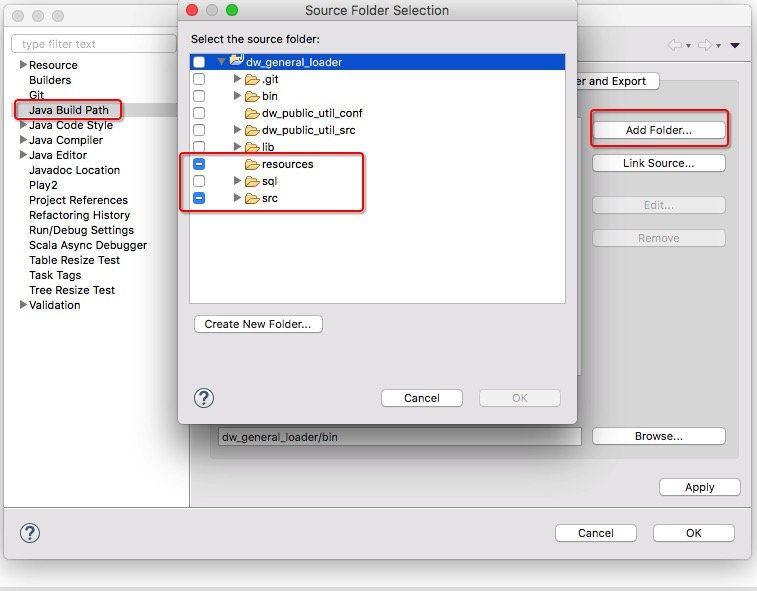
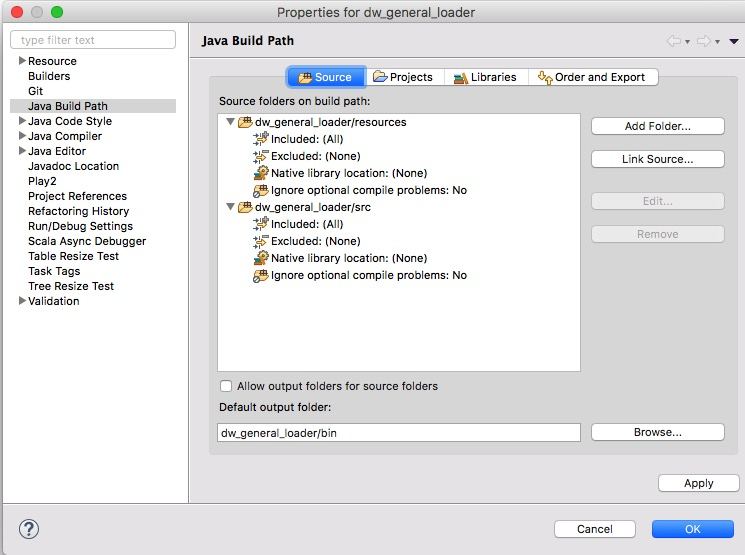
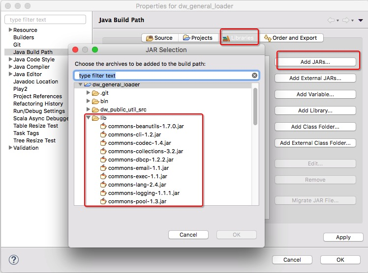
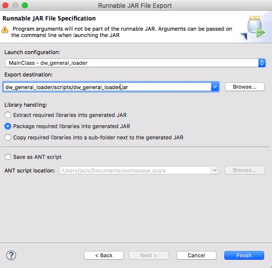

# dw_general_loader 项目开发组件

## 介绍

- 主要负责执行 hive Hql 存储过程
- hive to mysql 导入 等功能


## 环境搭建

``` sh

1. 创建工作目录
  mkdir ~/app
  cd ~/app

  mkdir -p /data/log/dwlogs/hivetmplog/ || /var/log/dw_general_loader/hivetmplog/
  mkdir -p /data/log/dwlogs/mysqltmplog/ || /var/log/dw_general_loader/mysqltmplog/
  mkdir -p /data/log/dwlogs/tmplog/ || /var/log/dw_general_loader/tmplog/
  mkdir -p /tmp/dw_tmp_file || /var/log/dw_general_loader/dw_tmp_file

2. 克隆最新代码到本地
  dw_general_loader 所在仓库
  git clone git@git.corp.angejia.com:dw/dw_general_loader.git

  项目公共配置文件仓库
  git clone git@git.corp.angejia.com:dw/conf.git 克隆配置文件仓库
  cd ~/app/conf  
  git fetch origin develop 切换到 develop 分支，以此分支作为配置环境


3. 因为代码本身不放配置文件，所以要导入 conf 仓库的配置文件

  1) ~/.bashrc 配置环境变量

    # APP PATH 和 HIVE_HOME
    export ANGEJIA_APP_PATH=~/app
    export DW_CONF=$ANGEJIA_APP_PATH/conf
    export DW_GENERAL_LOADER_HOME=$ANGEJIA_APP_PATH/dw_general_loader

    export HIVE_HOME=/usr/local/hive

    source ~/.bashrc
  2) 配置 conf 仓库
    conf 仓库有 2 个分支，分别是 master 线上分支，和 develop 开发分支，分别放了线上和线下的配置参数, 软链配置目录

    ln -s $DW_CONF/dw_general_loader/resources $DW_GENERAL_LOADER_HOME/resources


4. 运行

  调用 main.MainClass 运行, 打成 run jar 包，放在 $DW_GENERAL_LOADER_HOME/scripts/dw_general_loader.jar

  * 选择一个运行方式, 需要指定环境变量 DW_GENERAL_LOADER_HOME(项目部署目录) , HIVE_HOME(hive 目录)

  1) 指定配置运行
  java -Dfile.encoding=UTF-8 -DDW_GENERAL_LOADER_HOME=$DW_GENERAL_LOADER_HOME -DHIVE_HOME=$HIVE_HOME -jar $DW_GENERAL_LOADER_HOME/scripts/dw_general_loader.jar da_article

  2) 使用系统环境运行
  java -Dfile.encoding=UTF-8 -jar $DW_GENERAL_LOADER_HOME/scripts/dw_general_loader.jar da_article


5. 部署
  1) 上传到 dwtest 测试环境
    scp $DW_GENERAL_LOADER_HOME/scripts/dw_general_loader.jar hadoop@dwtest:/home/hadoop/app/dw_general_loader/scripts/

  2) 上传到 bi3 线上环境
    scp $DW_GENERAL_LOADER_HOME/scripts/dw_general_loader.jar dwadmin@bi0:/home/dwadmin/bi_server_dir/bi3/data/app/dw_general_loader/scripts/


```


## Eclipse 配置参考

- 依赖组件
- Mysql
- Hive 客户端(hive shell)
- jdk 1.7

```
通过输入 moudule_name 去数据表 dw_monitor.dwms_dev_task 查询出 details 的结果数据
通过 hive 客户端 和 mysql 客户端，数据交流
```

### 1.加载 resources 配置文件






### 2. 加载类包




### 3. 编译打包


