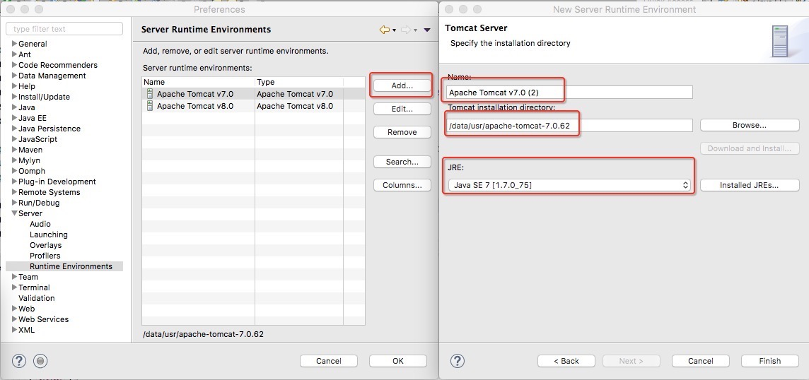
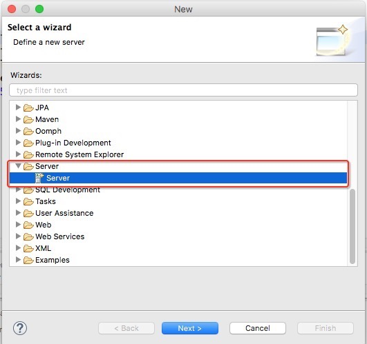
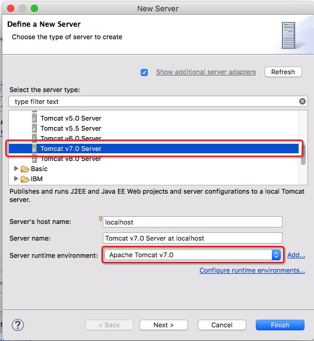
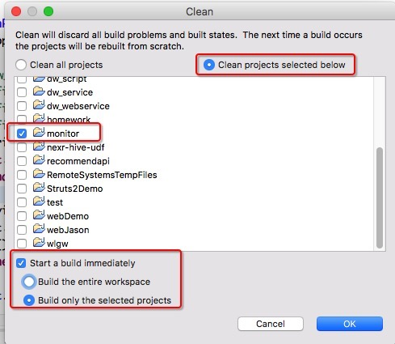
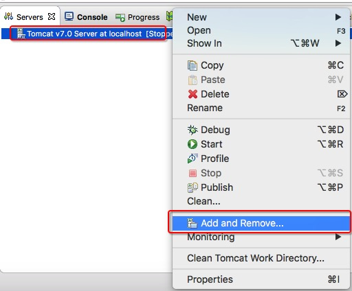
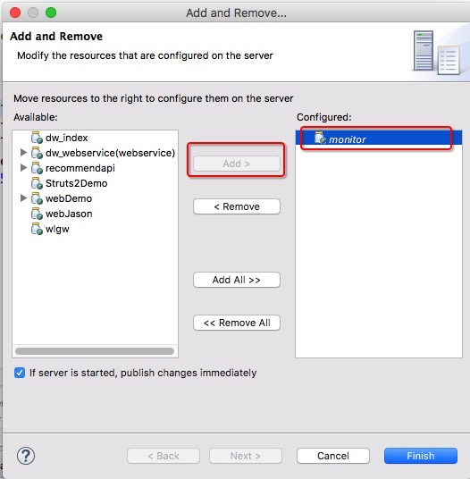
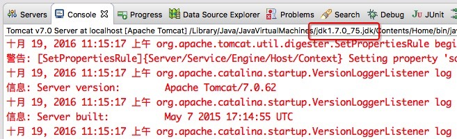

# monitor

## * 介绍

- 项目开发界面管理
- minireport 界面管理
- 调度系统界面管理


## 一、搭建开发环境和服务

### 1. 下载 monitor

``` sh
#下载代码
  cd ~/app/
  git clone git@git.corp.angejia.com:dw/monitor.git
  cd monitor

# 设置配置配置环境
  ln -s ~/app/conf/monitor/resources ~/app/monitor/src/resources

# 配置 monitor 工作目录
  mkdir -p /data/log/dwlogs/schedule_log/excute_logs/ ||  mkdir -p /var/log/schedule_log/excute_logs

  mkdir -p /data/log/dwlogs/monitor/mini/upload/ || mkdir -p /var/log/monitor/mini/upload/
```

### 2. web 集成开发环境

- JDK 7 和 Tomcat7

- Eclipse Java EE IDE for Web Developers 编辑器

- 配置 Tomcat Server 环境

 

- 创建 Tomcat Server 工程

 

 


### 3. 配置 monitor 项目

- 导入 monitor 项目到工程中

- 编译 monitor

 

 

- 配置 monitor 到 web 集成开发环境 中

 

 

- 检测 minitor 是否运行在 JDK 7 的环境中

 


## 二、开发调试

### 1. 依赖服务

- 使用 tomcat 7 作为服务
- 依赖调度服务器 dw_scheduler_agent (必须开启)
 - 注意 com.ajk.dw.modules.scheduler.service.impl 是这个类的成员属性(host) 来绑定调度的
- 依赖 dw_hive_server (必须开启)
- 依赖 dw_general_loader

 ``` sh
  1. 配置 dw_general_loader 模块, 用于执行 hive sql 脚本
    ln -s $DW_GENERAL_LOADER_HOME/scripts/dw_general_loader.jar ~/dwetl/dw_general_loader.jar

  2. 配置 scheduler_shell_hadoop 脚本, 用于执行 shell 类型脚本
    ln -s $DW_SCHEDULER_AGENT_HOME/scripts/scheduler_shell_hadoop.sh ~/dwetl/scheduler_shell_hadoop.sh
 ```

- mysql (mysql-5.6)

  ``` sql
  # 不区分大小写
  lower_case_table_names = 1

  ```


### 2. 调试部署

```sh

*. 注意需要编译项目时, 查看 WebRoot/WEB-INF/classes/ 目录下的配置是否生效

   ls ~/app/monitor/WebRoot/WEB-INF/classes/

# dwtest 测试环境

  dw_etl_log            清空表
  dw_monitor_job_daily  清空表

  上传项目
    scp ~/app/monitor/run/monitor_dwtest.war hadoop@dwtest:/usr/local/tomcat-7-monitor/webapps/monitor.war

  清理缓存(jsp 缓存目录)
    ll /usr/local/tomcat-7-monitor/work/Catalina/localhost/monitor

  查看启动状态
    tail -f /usr/local/tomcat-7-monitor/logs/catalina.out

    netstat -tunp | grep 8081


# 部署 线上

  scp ~/app/monitor/run/monitor.war hadoop@dw6:/home/hadoop/app/monitor/run

  查看日志
    tail -f $TOMCAT_HOME/logs/catalina.out


  重启:
    $TOMCAT_HOME/bin/shutdown.sh
    $TOMCAT_HOME/bin/startup.sh

  查看服务是否启动
    netstat -tunp | grep 9080

```

- 导出项目

 


## 二、相关异常错误处理


```
-- java.lang.ClassNotFoundException: org.apache.jsp

  在第一次请求web服务器时，会执行如下过程：
  1、客户端发送请求给web容器
  2、web容器将jsp首先转译成servlet源码
  3、web容器将servlet源码编译成.class文件
  4、web容器执行.class文件
  5、web容器将结果返回给客户端

  导致: $TOMCAT_HOME/work/Catalina/localhost/monitor/org/apache/jsp/ 没有把 .jsp 编译成 .class

  原因: 项目的 jsp-api.jar 和 servlet-api.jar ,  与 tomcat 的 jsp-api.jar 和 servlet-api.jar 冲突

  解决:
    1. 在 $TOMCAT_HOME/conf/context.xml
      加上, 并且让这个项目在单独的 tomcat 服务器上运行
      <Loader delegate="true" />

    2. 其他部署在 tomcat 项目中与本项目冲突, 比如 dw_webservice
      两个项目分开部署 (使用本方法)
```
