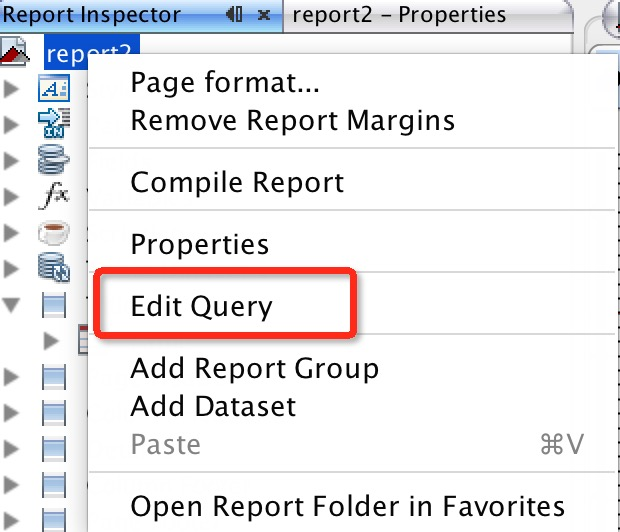
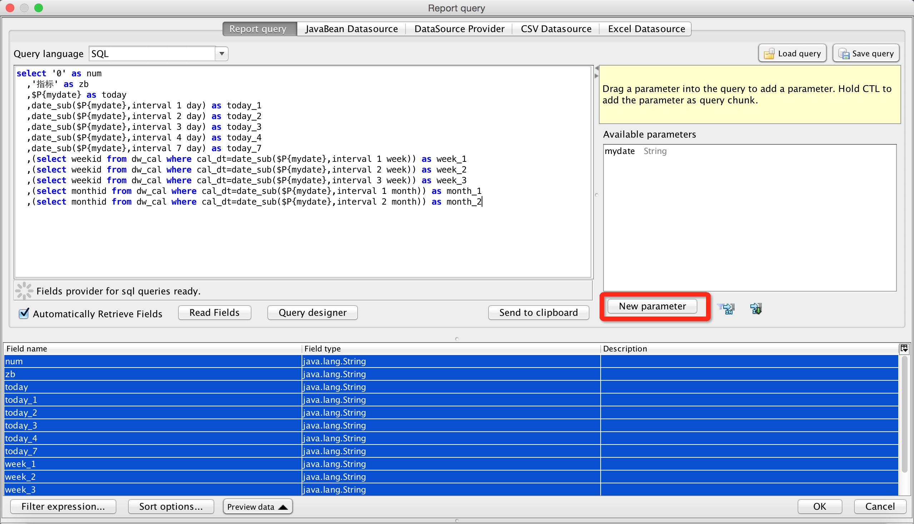
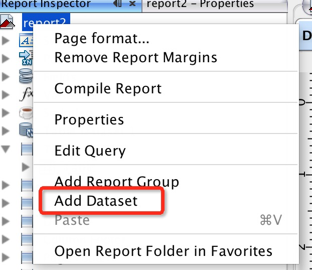
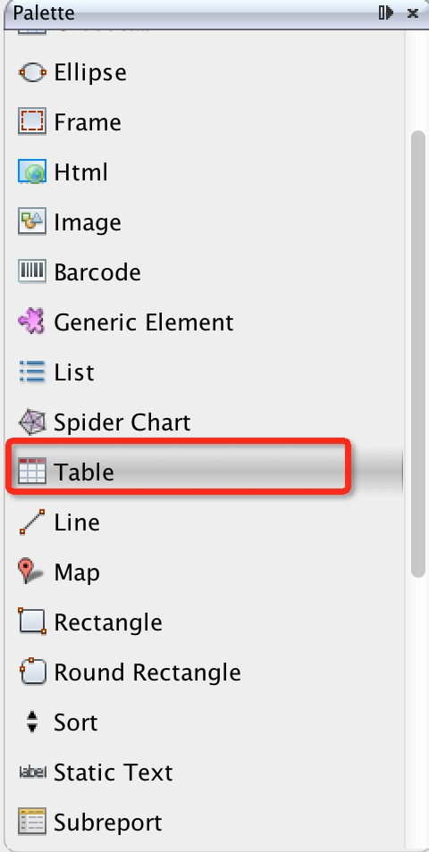
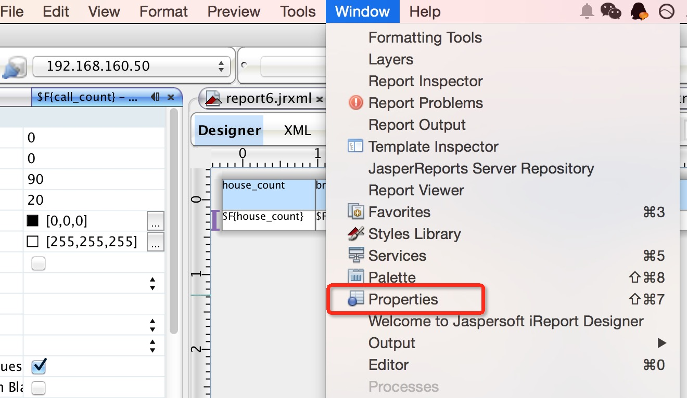

# ireport报表设计步骤

### 一、添加DataSources

选择数据源类型、数据库


### 二、新建Blank A4模板、编辑模板查询语句

报表查询语句

` 如果用不到模板数据也要填写正确的sql查询语句 `




新建parameters

` parameters对应 jasper server 中的控件 `




### 三、新建数据集、编辑查询语句
新建数据集合（for table）




编辑查询语句于上面类似


```

- `TIPS`：iReport支持多个DataSet，默认仅有一个Main Data Set。

```

### 四、新建table控件
新建table，读取上一步新建的数据集合




### 五、修改样式

根据需求修改table的样式




### 技巧总结

1.模板数据集参数传递到表格数据集

* 在T`able`数据集的`Parameters`中创建需要的变量名称
* 在`Main report`选项卡中，选中右键表格图标，选择`Edit table dataresource`，再选择`Parameters` 点击Add或Modify，添加修改parameter的值，这里可以指向模板数据集合的`Fields`中的数据

2.报表不分页设置方法

* 勾选模板属性的Ingore pagination
* 将表格放入模板的Title Brand 

3.Text控件表达式例子

* 两列相除表达式
	
```
	(new java.lang.Integer(null==$F{today_7}?0:$F{today_7}).intValue()<=0)?"/":new ava.lang.Integer(null==$F{today_01}?0:$F{today_01}).intValue()/new java.lang.Integer($F{today_7}).intValue()-1
```
* 条件样式表达式
	
```
	(new java.lang.Integer(null==$F{today_7}?0:$F{today_7}).intValue()<=0?0:new java.lang.Integer(null==$F{today_01}?0:$F{today_01}).intValue()/new java.lang.Integer($F{today_7}).intValue()
)<=1
```


4.设置Text控件显示格式

右键Text，选择Fields Pattern 

5.其他
* 可以在Fields里调整好字段顺序，导入表格后就不用手动调整字段顺序
* 在Report Inspector中选中Column 右键后可以添加列

6.超链接


```

 由于静态文本框不支持超链接,所以只能通过动态文本框为静态文字设置超链接
 
 需要在Table页签中找到需要添加超链接的字段位置，对于字段下方的变量右键新建Hyperlink
 
 需要在弹出页签里弹出输入表达式,如 "点击查看" **注意** 输入表达式要包含双引号
 
 ex: "点击查看"
 
 Text Field 的属性框:
 Hyperlink 选项卡,将 Hyperlink target 改为 blank;
 Hyperlink Type 改为 Reference;
 Hyperlink Reference Expression改为Nodejs启动的地址即可。**注意** 输入表达式要包含双引号

 ex: "http://10.10.91.51:3000"
 
```  


### 参考文件

 
[iReport-JasperReports报表开发指南.pdf](http://pan.baidu.com/wap/shareview?&shareid=21324246&uk=723760101&dir=%2F%E6%96%B0%E5%BB%BA%E6%96%87%E4%BB%B6%E5%A4%B9%2F32%E5%B8%B8%E7%94%A8%E6%A0%B8%E5%BF%83%E7%BB%84%E4%BB%B6%2F2%E5%B8%B8%E7%94%A8%E6%A0%B8%E5%BF%83%E7%BB%84%E4%BB%B6%E7%94%B5%E5%AD%90%E4%B9%A6&page=1&num=20&fsid=1569208626&third=0)

[JasperReports+iReport报表开发详解_弄潮书库.pdf](http://pan.baidu.com/s/1gdvnWWF)

# Jasper Server

### 注意事项


- `如果使用nginx 代理 ，需要修改如下配置`

/WEB-INF/esapi/Owasp.CsrfGuard.properties

Change:

	 org.owasp.csrfguard.TokenName=JASPER_CSRF_TOKEN
	 
	 org.owasp.csrfguard.SessionKey=JASPER_CSRF_SESSION_KEY

To:

	org.owasp.csrfguard.TokenName=JASPERCSRFTOKEN

    org.owasp.csrfguard.SessionKey=JASPERCSRFSESSIONKEY

[参考链接](http://stackoverflow.com/questions/17920949/running-jasperserver-behind-nginx-potential-csrf-attack)

### jrxml文件导入Jasper Server

[jasper server 地址](http://dw.corp.angejia.com/jasperserver/login.html)

1.添加数据链接：登陆Jasper系统，右键`System Properties`，添加资源>数据源

2.导入jrxml：右键	`report`,添加资源>Jasper Report

3.`控件和资源` 设置里的 `创建输入控件` 部分的 `参数名`要与报表中的参数名称匹配

**注意** 使用英文命名，中文字符不支持。


### 角色添加

- 管理>角色>添加角色，增加角色，角色根据公司组织架构增加

- 修改文件夹，对应角色的权限为`仅执行`可以隐藏文件夹，但可以执行内部文件

-现有角色

    1. 业务
    2. 产品
    3. 运营
    4. 市场
    5. HR  
    6. 信息
    7. 技术
    8. 数据
    9. 法务
    10.行政
    11.财务
    12.经理
    13.总裁办